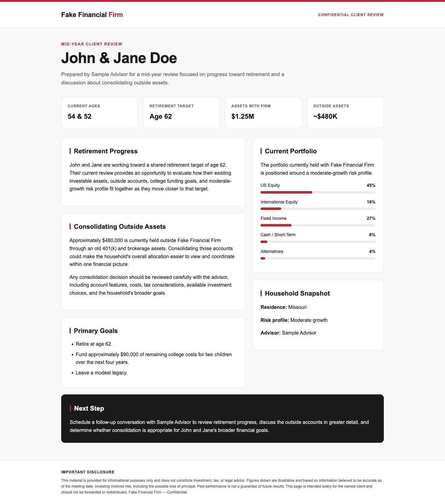

# Fake Financial Firm AI Client Portal

## Project Overview

This project is an AI client portal built for the Fake Financial Firm
assessment. Advisors enter structured client data, Claude generates personalized
narratives, advisors review the output, and an approved client page is published
behind a password-protected link.

All client data is fictional assessment data.

## Live Application

Production URL: [https://ai-client-portal-five.vercel.app](https://ai-client-portal-five.vercel.app)

The client-facing password is provided separately and is not stored publicly in
this repository.

## How It Works

1. An advisor signs in.
2. The advisor enters structured client data.
3. The validated data is stored in Supabase.
4. Claude generates a personalized narrative.
5. The advisor reviews the narrative.
6. The approved page is published.
7. The client receives a password-protected link.

## User Roles

- **Administrator:** Views advisors and clients, manages advisor access, and
  reassigns client ownership.
- **Advisor:** Manages assigned clients, structured inputs, narrative review,
  and publication.
- **Client:** Uses a client-specific URL and password to view the published page;
  no application account is required.

## AI Generation Approach

Claude generates only the personalized narrative from validated structured
client data. The application controls branding, factual values, page structure,
and the required disclosure so these remain deterministic and consistent.

ChatGPT was also used to generate a standalone branded HTML page artifact from
the John and Jane Doe assessment data as a demonstration of the assessment's AI
page-generation requirement.

### ChatGPT-Generated HTML Page



See the standalone [HTML artifact](docs/initial-ai-generated-page.html) and the
[AI-generation workflow](docs/ai-generation.md).

## Technology Stack

- Next.js App Router
- TypeScript
- Tailwind CSS
- Supabase Auth
- PostgreSQL
- Row Level Security
- Anthropic Claude API
- Vercel
- Node.js 22

## Security Approach

Administrators and advisors authenticate through Supabase. Client pages use a
separate client-specific password, stored only as a bcrypt hash in Supabase and
never as plain text. Successful verification grants temporary access to that
specific client page.

A production system handling real financial data would use stronger client
authentication, durable abuse protection, expanded audit logging, and security
monitoring.

## Run Locally

```bash
pnpm install
pnpm dev
```

Required environment variable names are listed in `.env.example`. Database
migrations are stored in `supabase/migrations`.

## Documentation

- [Architecture](docs/architecture.md)
- [AI-generation workflow](docs/ai-generation.md)
- [ChatGPT-generated HTML artifact](docs/initial-ai-generated-page.html)
- [HTML artifact preview](docs/initial-ai-generated-page-preview.png)
